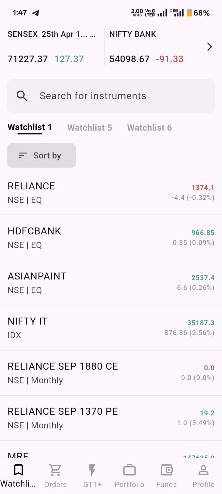
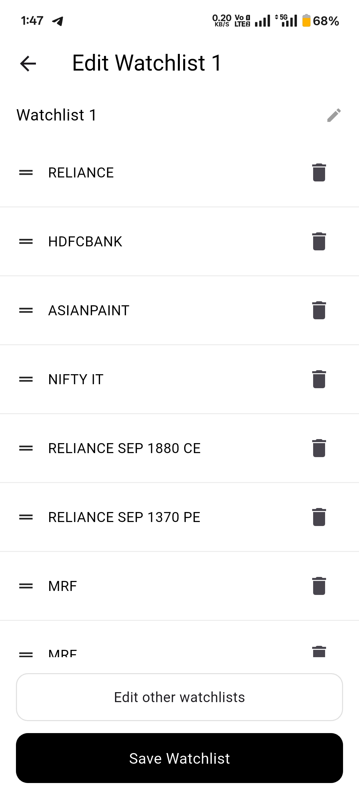

# watchlist_bloc_app

A new Flutter project.

## Getting Started

This project is a starting point for a Flutter application.

A few resources to get you started if this is your first Flutter project:

- [Lab: Write your first Flutter app](https://docs.flutter.dev/get-started/codelab)
- [Cookbook: Useful Flutter samples](https://docs.flutter.dev/cookbook)

For help getting started with Flutter development, view the
[online documentation](https://docs.flutter.dev/), which offers tutorials,
samples, guidance on mobile development, and a full API reference.

## Project Overview Here 

## 🏗️ Project Structure

lib/
│
├── core/
│   ├── constants/        # App colors, constants
│   ├── utils/            # Formatters (date, number)
│
├── data/
│   ├── models/           # Stock model
│   ├── datasources/      # Dummy data / future API layer
│
├── logic/
│   ├── watchlist/        # Watchlist BLoC (reorder, delete)
│   ├── market/           # Market BLoC (live simulation)
│
├── presentation/
│   ├── screens/          # Watchlist & Edit screens
│   ├── widgets/          # Reusable UI components
│
└── main.dart             # Entry point

### 📌 Explanation

The project follows a clean architecture approach:

- **core** → Common utilities and constants
- **data** → Models and data sources
- **logic** → BLoC state management
- **presentation** → UI layer (screens & widgets)

This separation improves scalability, maintainability, and testability.

## 🎥 Demo

Watchlist app with:
- Drag & drop reorder
- Delete stocks
- Live market simulation using BLoC
- 
## 📸 Screenshots

## 💡 Key Highlights

- Implemented BLoC for state management
- Used ReorderableListView for drag & drop
- Created reusable widgets for clean UI
- Simulated real-time market updates

## 🛠️ Tech Stack

- Flutter
- Dart
- BLoC (flutter_bloc)

## 🤔 Why BLoC?

BLoC was used to separate business logic from UI, making the app scalable, testable, and maintainable.
